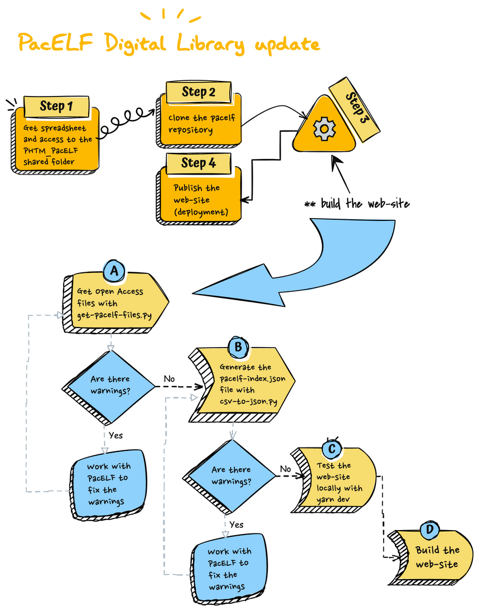

# PacELF Digital LIbrary

This repository contains code to create a digital library website for the PacELF Endgame Project. This website is available at https://pacelf.github.io

It is built using the Quasar JS framework and ItemsJS to index, search and download documents. The document data for the website is converted from an Excel spreadsheet to a JSON file by Python scripts.

Note: This website has only been built on a MacOS system.



## Overview
The researchers collating the documents (publications, reports, etc.) maintain a
spreadsheet with the information about documents (open access or not) in a sheet called _Repository_.
The spreadsheet may contain other sheets and the _Respository_ sheet may contain
other data than is to be shown on the website for internal purposes.

Copies of open access documents are stored in a known place so that they will be
available if the original online source disappears and in the case of documents
that were never available online before. They may all be in one
folder or there may be subfolders.

The spreadsheet is processed by [python](https://www.python.org/) scripts in the
_scripts_ folder to generate a _JSON_ file that provides the content to be displayed
and searched across in the _Digital Library_ website.
One of the scripts also copies the open access documents (that are marked as active)
into a folder that will be part of the website.

There is a config file, _scripts/library-config.ini_, that maps column labels, and
some column values, to variables that the python scripts need to process the data.

The website is a static website built using the [Quasar](https://quasar.dev/) framework.
For the [PacELF Digital Library](https://pacelf.github.io) we use [GitHub Pages](https://pages.github.com/) to make the digital library available.

## Spreadsheet structure
The digital library documents and links are gathered together and tracked in a sheet called "Repository" in a spreadsheet. Only the content from the Repository sheet will
be used when generating the website.

**There is a template spreadsheet, see scripts/inputs/library-index-template.xlsx.**

The sheet has 5 mandatory rows:
1. Row One contains either Filter_yes or Filter_no in each column.
   * This controls whether the values in each column are made available in the filter
  section on the left-hand side of the Library page.
2. Row Two contains either Search_yes or Search_no in each column.
   * This controls whether the values in each column are searched when someone
   enters text in the Search dialog above the filters in the Library page.
3. Row Three contains either FullDisplay_yes or FullDisplay_no in each column.
   * This controls whether the content in each column is displayed for the documents listed in the Library page.
   * These are also the only columns whose content is added to the library-index.json file that is sent to the website. Thus the repository managers can have whatever columns they want in the spreadsheet but only the ones they specify will end up in the website.
4. Row Four contains either MultiOption_no or MultiOption_yes in each column.
   * This indicates to the website builder scripts that the cells in this column
   contain multiple "values", separated by semi-colon characters.
   * This is primarily used for columns with Filter_yes and allows them to contain
  multiple filter values.
5. Row Five contains the labels for the data in the columns.
   * These will be used for display on the website on the Library page.

The sheet has 6 mandatory columns (the labels for these columns are configurable):
* ID
  * A unique identifier for the row's data, used by the search and filter
functionality.
* Title
  * The document's title.
* Access
  * The access types for the documents in the digital library;
  open access, access via publisher website, contact us.
  * The particular labels that you use for these types of access in your spreadsheet,
  and that will be displayed on the website, are defined in the library-config.ini file.
* Filename
  * The name of the document (only for open access documents).
  * Don't forget the file extension.
* PublishedURL
  * The URL to the document on the publishers website.
* Status
  * Active - only documents with an active status in the Status column will be added
  to the digital library.

## library-config.ini
The ini file has 6 sections:
* Library-docs
  * filePattern - What types of documents are you including in the digital library.
    * Don't change this value unless you know what you are doing.
  * srcPath - Path to the source documents top level folder.
  * destPath - Path to the folder within this repository to store the copies of the
  open access documents.
    * Don't change this unless you know what you are doing.
* Column-labels - The labels you have used within the spreadsheet for these mandatory
columns.
  * displayURL and displayIcon are columns that are created for the JSON file for use
  by the website code. Don't change these unless you change the website code.
* Access-values - The values used in the mandatory Access column in the spreadsheet.
* Status-values - The values used in the mandatory Status column in the spreadsheet.
* Icons - Choose the icons you want to use in the _Library Page_ document list to
indicate what type of document it is (open access, access via publisher, ...).
  * Selection can be made from [Material Icons](https://fonts.google.com/icons?selected=Material+Icons). Click on the icon to discover its name.
* URLs - These are website URLs that we need to add to our JSON file.
  * Do not change these unless you change the website code.

## Python setup
1. Install [python](https://www.python.org/downloads/), I used 3.11.4.

2. In the _scripts_ folder, create a [virtual environment](https://python.land/virtual-environments/installing-packages-with-pip) called .venv
(for consistancy with the bash script for running the python scripts).

3. Install the required libraries from the _requirements.txt_ file.

```bash
$ python3 -m venv .venv
$ source .venv/bin/activate
$ pip install -r requirements.txt
```

4. Edit the _library-config.ini_ file:
   * Add the path that the documents for the digital library will be copied from.
   * If you have renamed any of the columns from the
_scripts/inputs/library-index-template.xlsx_ when creating your spreadsheet then
update the appropriate sections.
   * Update the sections that contain column values to match those that you have used.

## Quasar CLI setup
[Quasar CLI](https://quasar.dev/start/quasar-cli) is used to build the website using the _library-index.json_ file generated
by the python scripts. We are using _@quasar/app-vite_ with _@quasar/cli_ for this website.

Required library and package manager versions:
* Node 18.18 (it is a good idea to use [nvm](https://www.freecodecamp.org/news/node-version-manager-nvm-install-guide/) to handle node versions and installation)
* [Yarn 1.22.19](https://classic.yarnpkg.com/lang/en/docs/install/#mac-stable)
* Quasar CLI 2.4.0

```bash
$ yarn global add @quasar/cli
```
#### Info on Quasar configuration (not needed to run the PacELF website from this repository)

See [Configuring quasar.config.js](https://v2.quasar.dev/quasar-cli-vite/quasar-config-js).

## Step 1 - Access
* Get a copy of the spreadsheet managed by the curators of the library.
* Setup access to the folder containing the open access documents from the computer that will be used to process the spreadsheet and build the website.
* Clone the main branch of this repository if you haven't already done so.

## Step 2 - Processing the spreadsheet
We use several python scripts, and one bash script, to process the spreadsheet.

1. Copy the spreadsheet from the digital library curators into _scripts/inputs_
2. Rename the spreadsheet to _library-index.xlsx_, if it has a different name.
3. Run the create-website-datafile.sh script from the _scripts_ directory.

```bash
$ bash create-website-datafile.sh
```
  * This will run the python scripts parse-excel-file.py, get-library-docs.py, and
   create-library-index.py, as well as clearing out the _scripts/logs_ and
   _scripts/outputs_ folders beforehand.
   * It will copy the _scripts/outputs/library-index.json_ into the
   appropriate folder for the website to use when it is built.
   * get-library-docs.py copies documents marked as Active in the spreadsheet into the _public/documents_ folder.
4. Review the log files in _scripts/logs_.

## Step 3 - Building the website
Before building the website you MUST process the digital library spreadsheet using
the python scripts successfully. See [Processing the spreadsheet](#processing-the-spreadsheet)

#### First time
The first time you want to build the website, run
```bash
$ yarn install
```

#### Start the app in development mode (hot-code reloading, error reporting, etc.)

```bash
$ quasar dev -m pwa
```
* change the code (and save it) while the dev site is running and it will automatically update the page showing in your browser.

#### Build the app for production

```bash
$ nvm use 18.18
$ quasar clean
$ quasar build -m pwa
```
#### Serve a UAT version of the app
```bash
$ quasar serve dist/pwa
```

## Step 4 - Publishing the website
After you have processed the spreadsheet and build the website, reviewed it for data errors and tested it, you are ready to publish.

1. Clone the gh-pages branch of this repository.
```bash
$ git clone --branch gh-pages --single-branch git@github.com:pacelf/pacelf.github.io.git gh-pages
```
2. Delete the contents of the gh-pages in your cloned branch (except the .git, .gitignore, etc.)
3. Copy files from the main branch's `dist/pwa` folder into the gh-pages
cloned repository.
4. Commit the changes to the gh-pages branch.

5. GitHub Pages are already configured to serve the content of `gh-pages` branch at `https://pacelf.github.io`. See the settings at https://github.com/pacelf/pacelf.github.io/settings/pages.
6. Look at https://github.com/pacelf/pacelf.github.io/actions to see how the deployment is progressing.
7. Test the website
8. If all is well, tag the changes:
   ```shell
   git tag -a phase<X>-gh-pages -m "website for phase <X>"
   git push origin phase<X>-gh-pages
   ```
9. Add, commit and push the changes to the main branch if you haven't already.

